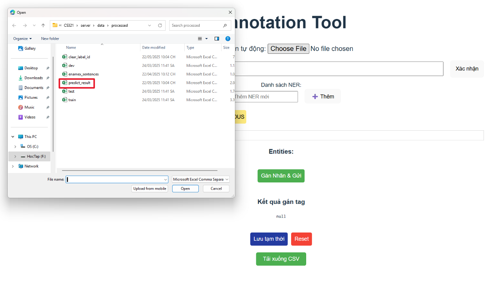
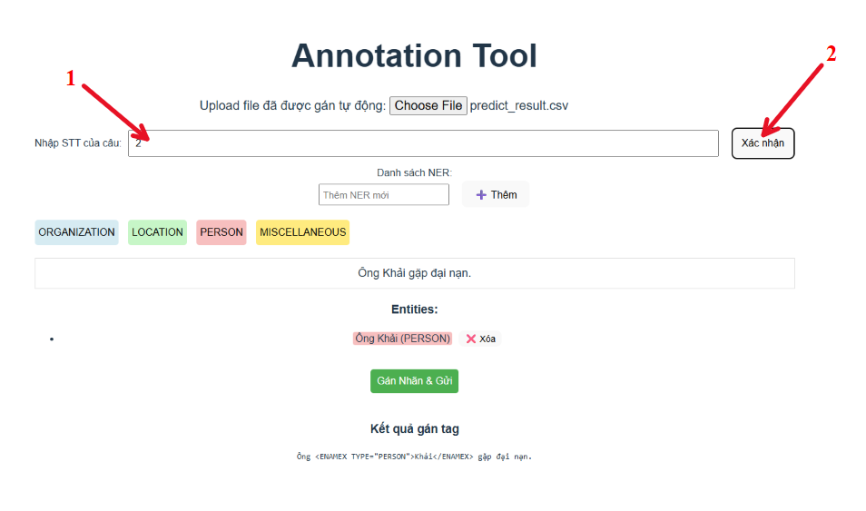
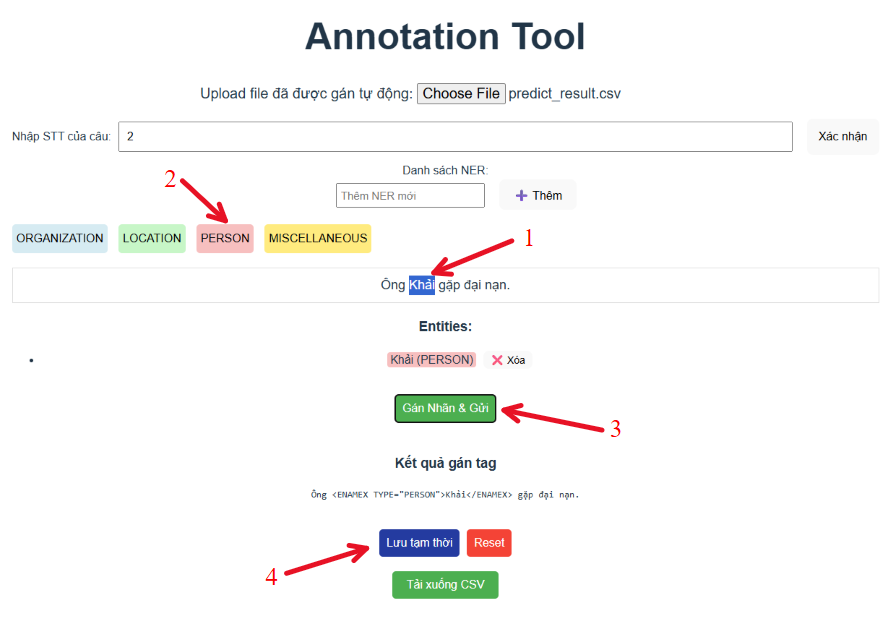
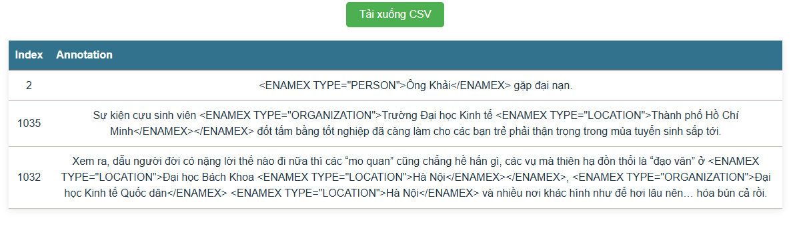

# 🏷️ Công Cụ Gán Nhãn NER Cho Tiếng Việt

Công cụ hỗ trợ huấn luyện mô hình và gán nhãn dữ liệu cho bài toán Nhận diện Thực thể Tên (Named Entity Recognition - NER) trong tiếng Việt.

---

## 📁 1. Clone Repository

```bash
git clone https://github.com/tamchamchi/CS321.git
cd CS321
```

---

## ⚙️ 2. Cài Đặt Môi Trường và Phụ Thuộc

Bạn cần cài đặt các gói phụ thuộc riêng cho `server` và `client`.

### 📂 Server

```bash
cd server
python -m venv .venv
source .venv/bin/activate  # Windows: .venv\Scripts\activate
pip install -r requirements.txt
cd ..
```

### 📂 Client

```bash
cd client
npm install
cd ..
```

---

## 🛠️ 3. Cài Đặt và Sử Dụng Preprocessing Tool

### 📌 Bước 1: Chuẩn Bị Dữ Liệu

Tạo thư mục chứa dữ liệu đã xử lý:

```bash
mkdir -p server/data/processed
```

Tạo 3 file CSV trong `server/data/processed/` với định dạng sau:

#### `train.csv`

```csv
id,raw_data
1,"Câu dữ liệu huấn luyện 1"
2,"Câu dữ liệu huấn luyện 2"
...
```

#### `test.csv`

```csv
id,raw_data
1,"Câu dữ liệu kiểm thử 1"
2,"Câu dữ liệu kiểm thử 2"
...
```

#### `enamex_sentences.csv`

```csv
id,sentences
1,"Câu có thực thể cần gán nhãn 1"
2,"Câu có thực thể cần gán nhãn 2"
...
```

### 🚀 Bước 2: Huấn Luyện Mô Hình

```bash
./scripts/train.sh
```

### 🔍 Bước 3: Dự Đoán Kết Quả Cho Gán Nhãn

```bash
./scripts/predict.sh
```

Kết quả dự đoán sẽ được lưu tại `server/data/processed/predict_result.csv`. File này là dữ liệu đầu vào cho công cụ gán nhãn.

---

## 🖍️ 4. Hướng Dẫn Sử Dụng Annotation Tool

Annotation Tool là giao diện người dùng trực quan giúp bạn gán nhãn thực thể trong văn bản, sử dụng kết quả dự đoán từ mô hình để tinh chỉnh thủ công.

### 📥 1: Chuẩn Bị Dữ Liệu Gán Nhãn

Sau khi chạy lệnh dự đoán:

```bash
./scripts/predict.sh
```

Một file `predict_result.csv` sẽ được tạo tại:

```
server/data/processed/predict_result.csv
```

### ⚙️ 2: Khởi Động Hệ Thống

#### ✅ Khởi động Backend (FastAPI)

```bash
cd server
source .venv/bin/activate  # Windows: .venv\Scripts\activate
uvicorn src.main:app --reload
```

#### 🌐 Khởi động Frontend (ReactJS)

Mở một terminal mới:

```bash
cd client
npm run dev
```

### 🔗 3: Truy Cập Giao Diện Gán Nhãn

- Mở trình duyệt và truy cập: [http://localhost:5173](http://localhost:5173)
- Giao diện sẽ hiển thị danh sách câu cần gán nhãn cùng với đề xuất thực thể từ mô hình.

### ✍️ 4: Gán Nhãn Thực Thể

- **Bước 1**: Import file `predict_result.csv` thông qua nút **Choose File**.

- **Bước 2**: Chọn câu cần gán nhán.

- **Bước 3**: Thực hiện quá trình gán nhãn theo 4 thao tác sau.
    1. Bôi đen thực thể cần được gán nhãn.
    2. Chọn nhãn thực thể.
    3. Bấm nút **Gán nhãn & Gửi**.
    4. Bấm nút **Lưu tạm thời**.


### 💾 Bước 5: Xuất Kết Quả

Khi hoàn thành, bấm nút **Tải xuống CSV** để lưu kết quả gán nhãn. Dữ liệu có thể được lưu dưới dạng `annotation.csv` hoặc CSV tùy chỉnh.


---

## ✅ 5. Hoàn Tất

- Truy cập frontend tại: [http://localhost:5173](http://localhost:5173)
- API backend chạy tại: [http://127.0.0.1:8000](http://127.0.0.1:8000)

---
